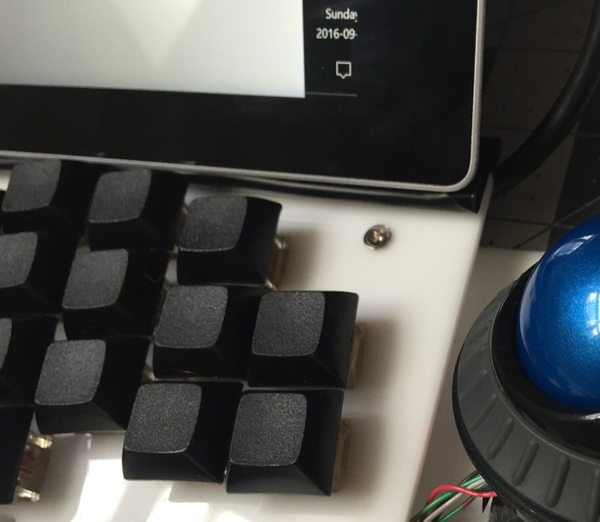
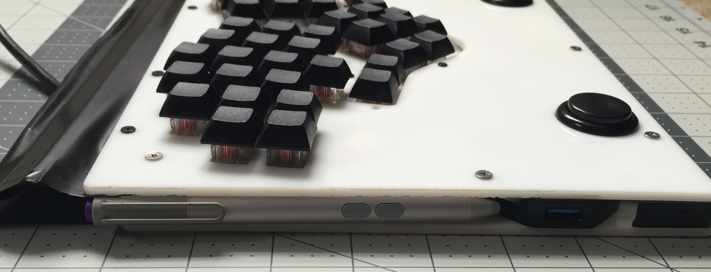
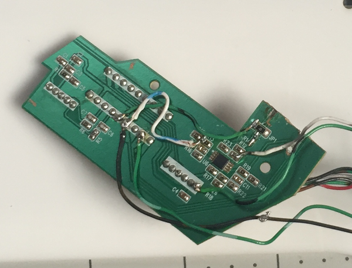

# Subsurface keyboard

---

Overall, this has mainly been a failed experiment. Several issues added up:

* The acrylic sides were fairly sharp, and this pressed into my palms when resting in the natural position. This was mainly because I did a poor job with the laser cutter on this piece. 
* The thumb positioning wasn't quite right. My natural position was between the middle two keys.
* I don't like DSA keycaps, and I just couldn't get used to them. I like ther Matias switches, but Alps keycaps are hard to come by.
* The hard drive in the unit was flakey. The Surface Pro 3 probably doesn't have enough power to reliably keep it going.  
* The connection to the Surface Pro works well once you get it set up, but it's klunky to set up and move around.

None of these by themselves are show stoppers, but in the end, I mostly stopped using this keyboard.

---

The Subsurface keyboard is a custom, hand-wired keyboard designed to mate with a
Surface Pro 3/4 tablet. See [here](https://github.com/tshort/qmk_firmware/tree/master/keyboards/subsurface/keymaps/default)
for the default key layout using the [QMK firmware](https://github.com/tshort/qmk_firmware/tree/master/keyboards/subsurface).

The key features include:

* Arcade buttons for palm keys
* Built-in USB hub
* 1-TB SSD drive
* Integrated trackball
* Recessed thumb keys

## Case

I laser cut the top and bottom panels from 3-mm acrylic. The main case
file is [here](case.svg). This includes top and bottom plates, a plate
for the recessed thumb layer, spacers for arcade buttons, spacers for
screws, and two rectangular parts for the tablet attachment.

I really like the recessed thumb keys. I used 3-mm thick spacers
between the top plate and the recessed plate, leaving the recessed
keys 6 mm lower than the top keys. That makes the main thumb keys more
comfortable, and it also makes it possible to use thumbs for more
keys. The bottom keys of the middle diamond are easy to hit with thumbs.

The top and bottom plates are held together with 10-mm spacers. I
could have probably used 9-mm spacers, but this gave lots of room for
components.

## Switches / keycaps

I used Matias quiet switches that are ALPS compatible. The biggest downside to
these switches is lack of keycap choices. I used DSA keycaps provided by
[Technomancy](http://atreus.technomancy.us/). 
[here](http://pimpmykeyboard.com/dsa-alps-mount-1-space-pack-of-10/).

## Internals and wiring notes

Here are the internals of the keyboard with the bottom plate off. The
core keys (30 total) are wired in a keyboard matrix. The rest are
direct wired, meaning each has a lead running to an I/O pin on the
Teensy++. Each of the direct-wired keys are columns in the overall
switch matrix (with just one row). I chose the Teensy++ because it has
so many I/O points. 

In addition to the keyboard components, I added a USB hub, an SSD
drive, and connections for a trackball. With this form factor, there
is a lot of room for components. 

The main key matrix was wired with veroboard stripboard. I have poor
soldering skills, and I didn't think I could manage a conventional
hand wiring. The veroboard helps hold components in place and makes
soldering easier. I used a hacksaw to cut the veroboard into sizes
appropriate for my key layout.

Alps switches have spacings that are almost perfect for veroboard. The
switch stabs are too big for the holes in the veroboard, so I drilled
them out with a 1/16" drill bit with a hand drill. This worked, but it
does leave a pretty big hole to have to fill with solder. If I was
going to do it over again, I'd either snip down the switch stabs to
fit in the existing holes, or use a smaller drill bit to try to slot
the hole more.

I used three columns in each veroboard. These are:

- Column 1 - second from the left - switch-to-diode connection - this
  is broken between each row.
- Column 2 - second from the right - column bus - connects each switch
  on a column.
- Column 3 - last on the right - row bus - connects all rows
  together - this is broken between each row.

Diode legs are used to connect the row buses together. Some just
barely fit, and in one case, I had to wire this separately. 

I used 32-gage magnet wire to solder all of the common points on the
direct-wired key switches. This worked great because you don't have to strip
the wire; just wrap it around the posts a couple of times and solder.
For the direct wire keys, I used some wire I've had for a long time. I
think it's wire wrap wire. This worked best for soldering to the Teensy. 

Also note that the two keys on the far left and the two keys on the
far right are wired together. There's space to wire them to the
Teensy++, but I don't have a need for them now. 

## Arcade buttons

Palm keys are great for making it easier to type on different layers. This has 
been done a lot with the Kinesis Advantage: see [this Geekhack thread](https://geekhack.org/index.php?topic=26579.0).

For a layered keyboard that is relatively thin, the key is finding arcade
buttons that are low profile. The lowest profile I could find are [from
AliExpress](https://www.aliexpress.com/item/Good-Quality-50-PCS-lot-30mm-Round-Push-Button-arcade-button-with-switch-buttons-for-arcade/32616257173.html?ws_ab_test=searchweb201556_0,searchweb201602_4_10057_10056_10065_10068_10055_10067_10054_10069_10059_10058_10073_10017_10070_10060_10061_10052_10062_10053_10050_10051,searchweb201603_4&btsid=2fac99be-c400-4b51-9a16-76aee1e00ec7).
It's not obvious, but these use Alps-compatible switches. I swapped the switches
out with Matias Quiet Click switches.

These buttons fit easily in a 10-mm gap with the switch pins bent. The
[case file](case.svg) includes spacer rings to lift up the buttons.
With these, the internal space can be even smaller. I didn't use
these.

  
## Connection to the Surface Pro

The connection to a Surface Pro mimics that of a TypeCover keyboard. This
attaches to the bottom of the tablet with six magnets. An acrylic plate attaches
to the front of the tablet with two magnets on either side. Adhesive vinyl holds
the magnets and the acrylic plate together. I used my TypeCover keyboard as the
template to lay out the magnets. The six magnets that attach to the bottom of
the tablet are held together just with the vinyl. With the TypeCover keyboard
under the vinyl, the magnets fall nicely in to place. The TypeCover also formed
the template for the front plate. Before attaching to the vinyl, I used some
tape to hold the magnets in the acrylic plate. Once everything was in place, I
folded the vinyl over. It's not the prettiest, but it seems to work fine. This
arrangement can connect the keyboard and tablet a few ways. The normal way is
with the bottom and front magnets attached:

With the tablet only connected by the bottom magnets, there's some separation
between the tablet and keyboard:

The tablet can also rest on the keyboard:

The tablet can also rotate up and lay on the top of the keyboard. I
wouldn't carry it like that. The screen of the Surface Pro is pretty
fragile. I've already cracked mine. I'd like to use the back of the
keyboard to protect the tablet when it's in a backpack.

This attachment works well enough to hold things steady on my lap. But
for moving things around, I always grab the keyboard and tablet
separately.

The following picture shows where I plan to store the pen for the
tablet. I still need to order the pen loops to make this happen. The
pen will be recessed about half way.

## Trackball

The Kensington Orbit Trackball is a medium-sized trackball. It's a
fairly old design. I cut up the PCB and hid the main part in the case.
That meant I had to solder jumper wires between the trackball and the
main PCB. I also tried (and failed) at getting the scrollwheel
working. I messed up some connections to the part of the PCB where the
scrollwheel components were. Here views of the cut up PCB. 

I'm not sure that this work was all worth it for the trackball:) After
I cut up the PCB, I realized it would have been easier to remove the
IR emitter and receiver from the PCB and mount those separately on a
small piece of veroboard. That would have made the soldering much
easier because I could solder jumper wires to the holes where the
components were.

I'm not sure how well the trackball will hold up when carried in a
backpack. It could snag in things.

## Material list

- [Teensy++](https://www.pjrc.com/store/teensypp.html)
- [DSA keycaps](http://atreus.technomancy.us/) - [alternate source](http://pimpmykeyboard.com/dsa-alps-mount-1-space-pack-of-10/) [48]
- [Matias switches](http://atreus.technomancy.us/) - [alternate source](https://mechanicalkeyboards.com/shop/index.php?l=product_list&c=52) [52]
- [32 AWG magnet wire](https://www.amazon.com/gp/product/B00LV909HI/ref=oh_aui_detailpage_o05_s00?ie=UTF8&psc=1)
- Other wire 
- [4-port USB 3.0 hub](https://www.amazon.com/gp/product/B00PHPWLPA/ref=oh_aui_detailpage_o01_s00?ie=UTF8&psc=1)
- [20-in left angle USB 3.0 extension cable](http://www.usbfirewire.com/parts/rr-alaf-xxgr.html#RR-ALAF-20GR)
- [Kensington orbit trackball](https://www.amazon.com/Kensington-Orbit-Trackball-Scroll-K72337US/dp/B002OOWB3O)
- [SSD drive](https://www.amazon.com/Intel-Hard-1-0TB-2-5in-SSDSC2KW010X6X1/dp/B01C786KH4/ref=sr_1_2?ie=UTF8&qid=1473721578&sr=8-2&keywords=intel+ssd+540)
- [M.2 SSD drive case/adapter](https://www.amazon.com/gp/product/B01FUDHHLQ/ref=oh_aui_detailpage_o01_s00?ie=UTF8&psc=1)
- [10-mm M3 female-female spacers](http://www.ebay.com/itm/M3-x-4mm-60mm-Hex-Brass-Spacer-Female-Female-Screw-PC-Motherboard-Standoff-Riser-/172251701345?var=&hash=item281b006061:m:meKVFllD2MqSj3EwB1GtEuA) [12]
- [6-mm M3 wafer-head screws](http://www.metricscrews.us/index.php?main_page=product_info&cPath=13_122_152&products_id=796) [24]
- [12-mm M2.5 wafer-head screws](http://www.metricscrews.us/index.php?main_page=product_info&cPath=13_122_152&products_id=796) [12]
- [M2.5 nuts](http://www.metricscrews.us/index.php?main_page=product_info&cPath=81_90&products_id=4083) [12]
- [Veroboard stripboard](https://www.amazon.com/gp/product/B008CPVMMU/ref=oh_aui_detailpage_o03_s00?ie=UTF8&psc=1)
- [1N4148 diodes](https://www.amazon.com/gp/product/B00LQPY0Y0/ref=oh_aui_detailpage_o02_s01?ie=UTF8&psc=1) [30]
- [USB 2.0 breakout boards](https://www.amazon.com/gp/product/B01CEL1FW4/ref=oh_aui_detailpage_o05_s00?ie=UTF8&psc=1)
- [Vinyl with adhesive backing](https://www.amazon.com/Cricut-2002026-Vinyl-Midnight/dp/B00BV50AN0/ref=sr_1_2?ie=UTF8&qid=1473640240&sr=8-2&keywords=cricut+vinyl)
- [1/4" x 1/8" x 1/8" magnets](https://www.kjmagnetics.com/proddetail.asp?prod=B422) [10]
- [3-mm cast acrylic](http://www.mcmaster.com/#acrylic/=144mfom)
- USB mini B cable

## Future improvements

Some options I may consider for the future include:

* *Mouse button* -- The mouse button is too far away from the
  trackball. It'd be better right next to the edge of the keyboard.

* *Center thumb buttons* -- Overall, I like the placement of the thumb
  row. I like the recessed layer. But, my ideal thumb position for the
  space bar seems to be in the gap between the center two thumb keys.
  I could shift the keys outward slightly or make some custom keycaps
  that widen the space key.

* *Feet or backing* -- I need feet or something to protect my desk.
  I've already scratched it. Something like an EPDM sheet might work
  well. That could also act as a screen protector if I flip the SP3
  around.

* *Thumb wheel* -- Try to get it working.

* *Key removal tool* -- One thing I don't like about the Matias
  switches with these DSA keycaps is that they are extremely hard to
  take off. I've broken a couple of switches already. A tool to help
  get them apart might help.
  
* *Better laser cutting* -- My laser cutting has a couple of mistakes.
  For the outer edge, I'd cut it slower to get a smoother finish.

* *Trackball* -- The exposed trackball has a bright LED. Electrical
  tape can cover some of it, but there may be a better solution.
